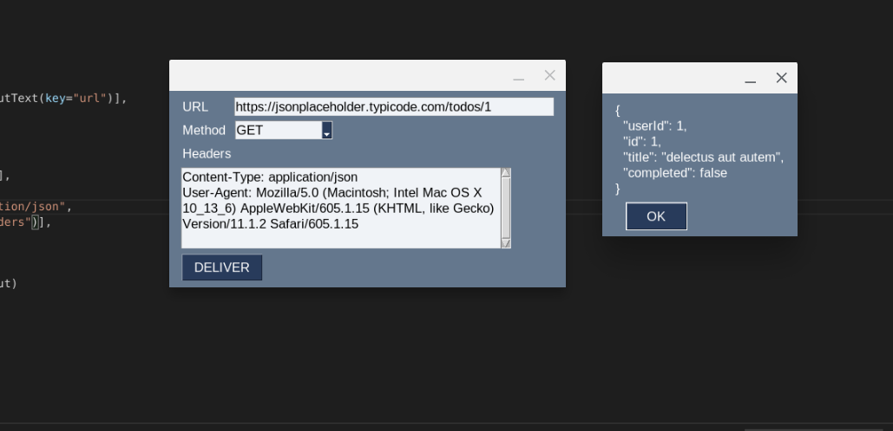

# MessengerLite 🧙

Messenger (Lite) is a GUI tool that allows you to send HTTP requests simply. 



## Current Status

Right now, it only accepts [`GET`](https://developer.mozilla.org/en-US/docs/Web/HTTP/Methods/GET) request methods but accepts any valid HTTP links. The tool also accepts headers, where it converts the following headers into JSON and uses one of the required packages (`requests`) to send the headers during the request.

## Get Started

Install all of the required packages using `pip`.

*Linux Users* `$ python3 -m pip3 install -r requirements.txt`
*Windows Users* `C:\>pip install -r requirements.txt`

Then run the `src/main.py` file.
```sh
$ python3 src/main.py
```

# Brains of the code 🧠

## Headers Conversion

Examples of the user given header:
```yaml
Content-Type:application/json
authorization: "LovelyToken420"
password            : ILoveCoding.NotReally42
```

*Gets converted to; using the `HeadersManager` method (./src/Messenger.py Line 40)*

```json
{
    "Content-Type": "application/json",
    "authorization": "\"LovelyToken420\"",
    "password": "ILoveCoding.NotReally42"
}
```

*This uses the `.strip()` method to avoid any given/accidental whitespaces*

# Upcoming

## Future Updates 

I, 100%, accept any helping pull requests or help in this project. The following is also a list I want to add to the project (with some help, of course) in the next update.

- [ ] Accept `POST`, `DELETE`, `PUT` Methods 
- [ ] Exactly specify error (rather than saying it might be "this or that or this" in 1 error popup)
- [ ] Fix colour spectrum of the GUI (handle Light & Dark modes)
- [ ] Add `body` text input area for POST methods